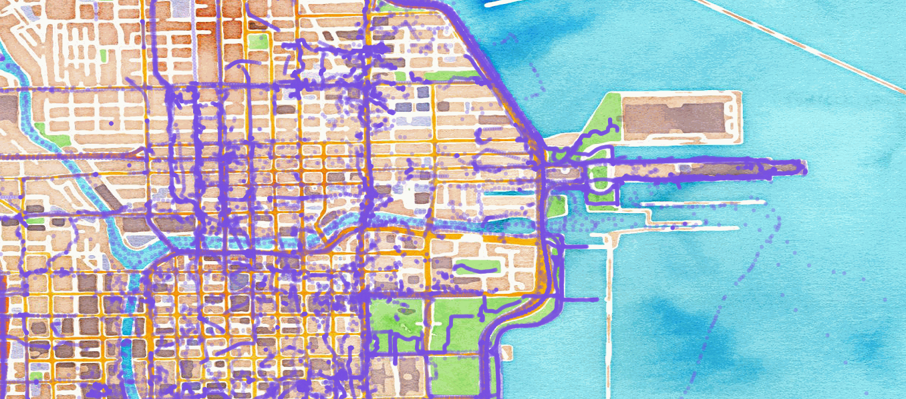
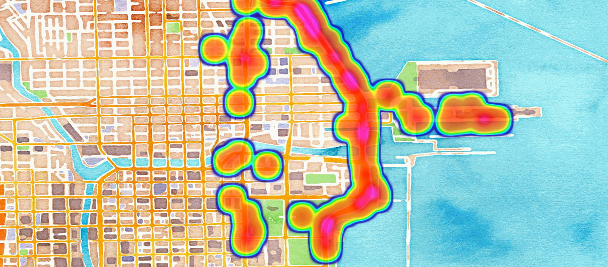

GeoMesa Storm Quick Start
============================

Apache Storm is

> a free and open source distributed realtime computation system.

You can leverage Storm to analyze and ingest data into GeoMesa in near real time. In this tutorial, we will:

1. Use Apache Kakfa to send messages to a Storm topology.
2. Use Storm to parse Open Street Map (OSM) data files and ingest them into Accumulo.
3. Leverage Geoserver to query and visualize the data.

Prerequisites
-------------

You will need access to:

* an instance of Accumulo 1.5 or 1.6
* an Accumulo user with create-table and write permissions
* an installation of Kafka 0.8
* an installation of Storm 0.8
* an instance of GeoServer 2.8.1 with the GeoMesa Accumulo plugin installed

In order to install the GeoMesa Accumulo GeoServer plugin, follow the instructions
[here](https://github.com/locationtech/geomesa/tree/master/geomesa-gs-plugin/geomesa-accumulo-gs-plugin).

You will also need:

* The [xz](http://tukanni.org/xz/) data compression tool
* [Java JDK 8](http://www.oracle.com/technetwork/java/javase/downloads/index.html)
* [Apache Maven](http://maven.apache.org) 3.2.2 or better
* a [git](http://git-scm.com/) client

Download and Build the Tutorial
--------------------------

Pick a reasonable directory on your machine, and run:

```bash
$ git clone git@github.com:geomesa/geomesa-tutorials.git
$ cd geomesa-tutorials
```

To build, run

```
$ mvn clean install -pl geomesa-quickstart-storm
```

> :warning: Note: ensure that the version of Accumulo, Hadoop, Storm, etc in the root `pom.xml` match your environment.

<span/>

> :warning: Note: depending on the version, you may also need to build GeoMesa locally.
> Instructions can be found [here](https://github.com/locationtech/geomesa/).

Obtaining OSM Data
------------------

In this demonstration, we will use the `simple-gps-points` OSM data that contains only the location of an observation.
Download the [OSM](http://planet.openstreetmap.org/) data here: [http://planet.openstreetmap.org/gps/simple-gps-points-120312.txt.xz]().

> :warning: Note: the file is approximately 7 GB.

Use the following command to unpack the data:

```bash
$ xz simple-gps-points-120312.txt.xz
```

Deploy the Ingest Topology
------------------------------

The quickstart topology will read messages off of a Kafka topic, parse them into `SimpleFeature`s,
and write them to Accumulo.

Use `storm jar` to submit the topology to your Storm instance:

```bash
$ storm jar geomesa-quickstart-storm/target/geomesa-quickstart-storm-$VERSION.jar \
    com.example.geomesa.storm.OSMIngest \
    -instanceId <accumulo-instance-id>  \
    -zookeepers <zookeepers>            \   
    -user <accumulo username>           \
    -password <accumulo password>       \
    -tableName OSM                      \
    -featureName event                  \
    -topic OSM
```

Run Data through the System
---------------------------

We use Kafka as the input to our Storm topology. First, create a topic to send data:

```bash
$ kafka-create-topic.sh      \
    --zookeeper <zookeepers> \
    --replica 3              \
    --partition 10           \
    --topic OSM              \
```

Note that we create a topic with several partitions in order to parallelize the ingest from the producer
side as well as from the consumer (Storm) side.

Next, use the tutorial code to send the OSM file as a series of Kafka messages:

```bash
$ java -cp geomesa-quickstart-storm/target/geomesa-quickstart-storm-$VERSION.jar \
    com.example.geomesa.storm.OSMIngestProducer \
    -ingestFile simple-gps-points-120312.txt    \
    -topic OSM                                  \
    -brokers <kafka broker list>                \
```

Note that Kafka's default partitioner class assigns a message partition based on a hash of the provided key. 
If no key is provided, all messages are assigned the same partition.

```java
for (String x = bufferedReader.readLine(); x != null; x = bufferedReader.readLine()) {
    producer.send(new KeyedMessage<String, String>(topic, String.valueOf(rnd.nextInt()), x));
}
```

Storm Spouts and Bolts
----------------------

In the quick start code, the Storm `Spout`s consume messages from a Kafka topic and send
them through the ingest topology:

```java
public void nextTuple() {
    if (kafkaIterator.hasNext()) {
        List<Object> messages = new ArrayList<Object>();
        messages.add(kafkaIterator.next().message());
        _collector.emit(messages);
    }
}
```

The `Bolt`s parse the message and create and write `SimpleFeature`s.
In the `prepare` method of the `Bolt` class, we grab the connection parameters
that were initialized in the constructor and get a handle on a `FeatureWriter`:

```java
ds = DataStoreFinder.getDataStore(connectionParams);
SimpleFeatureType featureType = ds.getSchema(featureName);
featureBuilder = new SimpleFeatureBuilder(featureType);
featureWriter = ds.getFeatureWriter(featureName, Transaction.AUTO_COMMIT);
```

The input to the `Bolt`'s execute method is a `Tuple` containing a `String`. We split
the `String` on '%' to get individual points. For each point, we split on commas to
extract the attributes.  We parse the latitude and longitude field to set the default
geometry of our `SimpleFeature`.  Note that OSM latitude and longitude values are stored
as integers that must be divided by 10<sup>7</sup>.

```java
private Geometry getGeometry(final String[] attributes) {
    ...
    final Double lat = (double) Integer.parseInt(attributes[LATITUDE_COL_IDX]) / 1e7;
    final Double lon = (double) Integer.parseInt(attributes[LONGITUDE_COL_IDX]) / 1e7;
    return geometryFactory.createPoint(new Coordinate(lon, lat));
}

public void execute(Tuple tuple) {
    ...
    featureBuilder.reset();
    final SimpleFeature simpleFeature = featureBuilder.buildFeature(String.valueOf(UUID.randomUUID().getMostSignificantBits()));
    simpleFeature.setDefaultGeometry(getGeometry(attributes));

    try {
        final SimpleFeature next = featureWriter.next();
        for (int i = 0; i < simpleFeature.getAttributeCount(); i++) {
            next.setAttribute(i, simpleFeature.getAttribute(i));
        }
        ((FeatureIdImpl) next.getIdentifier()).setID(simpleFeature.getID());
        featureWriter.write();
    } catch (Exception e) {
      ...
    }
}
```

Register the Layer in GeoServer
-------------------------------

Log into GeoServer using your credentials. Click “Stores” in the left-hand gutter and
“Add new Store”. If you do not see the Accumulo Data Store listed under Vector Data Sources,
ensure the plugin and dependencies are in the right directory and restart GeoServer.

Select the `Accumulo (GeoMesa)` vector data source and configure it using the command line arguments you
used above. Use `geomesa` as the workspace - if you use something different, you will need to modify the
WMS requests below.

Leave all other fields empty or with the default value.

Click "Save" and GeoServer will search your data store for any available feature types.

Publish the Layer
-----------------

GeoServer should find the `OSM` feature type and present it as
a layer that can be published. Click on the "Publish" link. You will be taken to the Edit Layer screen. 

You can leave most fields as default. In the Data pane, you'll need to enter
values for the bounding boxes. In this case, you can click on the links to
compute these values from the data. Click "Save".

Visualize the Data
------------------

Let's look at events in Chicago. The default point style is a red square that does not
suit our purposes. Add [this](../assets/geomesa-quickstart-storm/OSMPoint.sld) SLD
file to GeoServer, call it OSMPoint.sld. Then browse to the following URL:

```
http://localhost:8080/geoserver/wms?service=WMS&version=1.1.0&request=GetMap&layers=geomesa:OSM&styles=OSMPoint&bbox=-87.63,41.88,-87.61,41.9&width=1400&height=600&srs=EPSG:4326&format=application/openlayers
```



Heatmaps
--------

Use a heatmap to more clearly visualize a high volume of data in the same location. Add
this [SLD](../assets/geomesa-quickstart-storm/heatmap.sld) file to
GeoServer, then browse to the following URL:

```
http://localhost:8080/geoserver/wms?service=WMS&version=1.1.0&request=GetMap&layers=geomesa:OSM&styles=heatmap&bbox=-87.63,41.88,-87.61,41.9&width=1400&height=600&srs=EPSG:4326&format=application/openlayers
```



Conclusion
----------

Although this quickstart uses a static file for input, Storm excels at reading real time data.
As data comes in, the Storm topology can parse it and ingest it into GeoMesa for retrieval.
Additional analytics can be run on the data inside the topology to further enhance or inform the output.
For real time visualization, GeoMesa also supports maps powered by Kafka instead of Accumulo.
See the [GeoMesa Kafka Quickstart](../geomesa-quickstart-kafka) for more details.